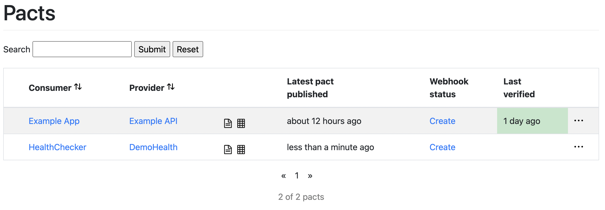
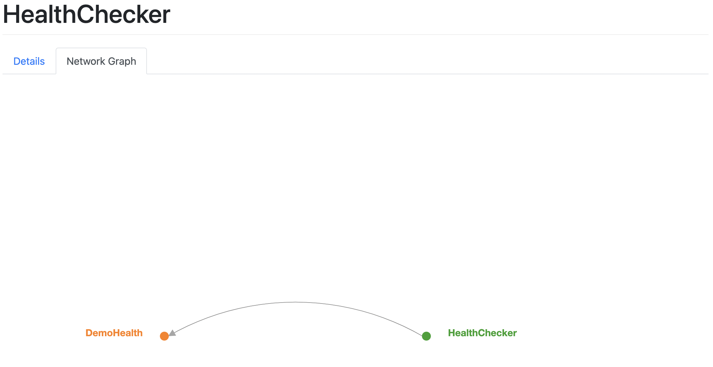
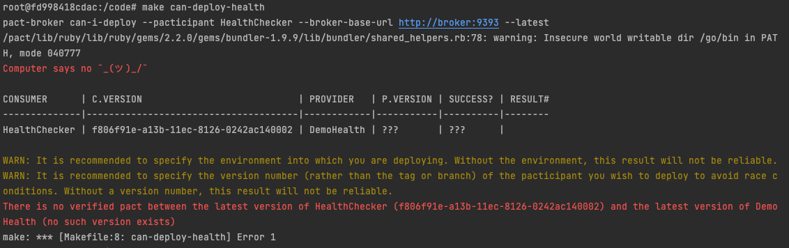
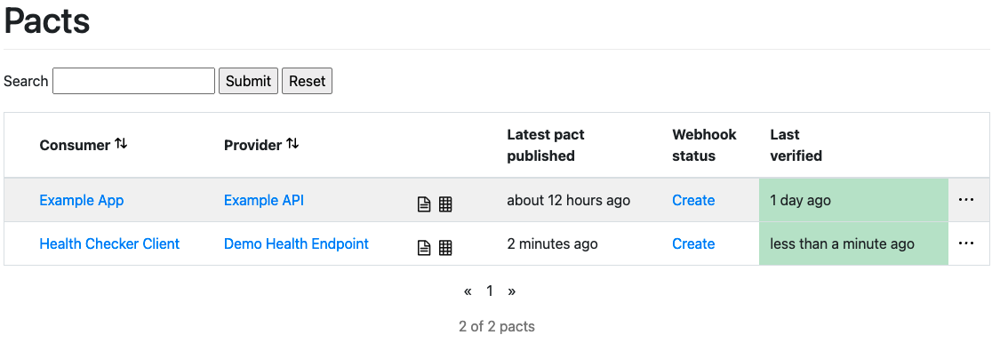
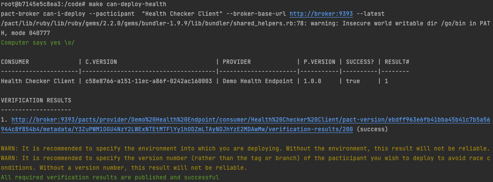

# Consumer Driven Contract Testing with Pact Workshop (Golang)

## Introduction 

### Purpose

The purpose of this Workshop exercise it to introduce you to Consumer Driven Contract testing using [Pact](https://pact.io/).

### What we will cover

During this workshop we will look at Using Pact to create a contract between an HTTP REST API and a client that consumes 
the API. The workshop is broken down into 3 parts:

1. We will look at concepts and language introduced by Pact. 
2. We will walk through a small example project to explore how to use Pact with Golang. 
3. You will create a contract for a single GET API endpoint.

### Things we will not be covering

- Using [Provider State](https://docs.pact.io/getting_started/terminology#provider-state) to populate a datasource to 
  enable dynamic testing of the Provider
- Pact Contracts for Async communication
- Setting up Pact in a CI/CD Pipeline

### Prerequisite

- [Docker](https://www.docker.com/products/docker-desktop/)
- [Docker-Compose](https://docs.docker.com/compose/)
- Knowledge of how to create and interact with HTTP REST APIs in Golang
  
## What is Pact?

Pact is testing tool that uses contracts to ensure the communication between services in your application.
The [Pact File](https://docs.pact.io/getting_started/terminology#pact-file) (Contract) is produced by test written for
the [Consumer](https://docs.pact.io/getting_started/terminology#service-consumer) and shared with the [Provider](https://docs.pact.io/getting_started/terminology#service-provider)
via a [Pact Broker](https://docs.pact.io/getting_started/terminology#pact-broker) (Centralized Repository for Pact Files).

Although this workshop uses Golang Pact is available in a [number of different languages](https://docs.pact.io/implementation_guides/cli).
All languages produce Pact Files in the same format so the Consumer and Producer can be written in different languages and
still communicate about the contract via the Pact File and Broker.

## Our Project

The code we will look at, and you will create is set up to run in Docker containers to allow you to concentrate on looking
at Pact and not having to install and configure you own machine to run Pact.

### Getting Started

To start the docker containers using the following Make target

```shell
make start
```
or 

```shell
docker compose up -d --force-recreate --build
```

This will start 4 separate containers:

1. Running a small demo application exposing HTTP REST API with two endpoints `/health` & `/thing/{id}`. (The Provider)
2. A Go environment with an example API client (The Consumer) to interact with the `/health` endpoint
3. A Pact Broker
4. Database for the Pact Broker (PostgreSQL)

### The API

We have already created a small HTTP Producer API that has two endpoints. 

#### Health Check Endpoint
The first is a health check endpoint (/health) that returns a small JSON object with hardcoded values.

```shell
curl http://localhost:8082/health
```

```json
{
  "Status": "OK",
  "message": "Testing Testing 123",
  "integer": 36,
  "float": 12.34,
  "boolean": true
}

```

#### Thing Endpoint

The second endpoint enables you to retrieve a single 'Thing' (/thing/{id}) if you request the id `123456789` there is not 
a thing stored against that ID and a HTTP 404 - Not Found will be returned.

```shell
curl http://localhost:8082/thing/123456789
```

```json
{
  "code": 404,
  "status": "NotFound",
  "message": "Could not find thing with id: 123456789"
}
```

If you request a 'Thing' by any other ID you will receive an HTTP 200 - OK response with a larger hard coded JSON 
object. 

```shell
curl http://localhost:8082/thing/987654321
```

```json
{
  "id": "987654321",
  "name": "Testing",
  "integer": 1357,
  "float": 4.56,
  "boolean": false,
  "smaller_thing": {
    "title": "",
    "age": 0
  },
  "strings": [
    "one",
    "two",
    "three"
  ],
  "integers": [
    1,
    2,
    3,
    4
  ],
  "smaller_things": [
    {
      "title": "First",
      "age": 3
    },
    {
      "title": "Second",
      "age": 2
    },
    {
      "title": "Third",
      "age": 1
    }
  ]
}
```

### Exploring the Example Project

#### The Consumer

The [Consumer](https://docs.pact.io/getting_started/terminology#service-consumer) is the code that interacts with an API. 

We have already created an [example Consumer](consumer/health/health.go) for the `/health` endpoint of our API. 
The [code](consumer/health/health.go) is commented to explain what is happening at all key points of execution, spend a 
few minutes exploring it to familiarise yourself with it before continuing. 

The code assumes that Making the HTTP call and decoding the JSON response is successful because you would not use Pact 
to test these bits of the code. Handling these errors should be covered by separate unit tests.

The [tests](consumer/health/health_test.go) that we used to drive out the implementation cover the expected response 
from the `/health` endpoint when the service is running and healthy. The tests are commented to explain how to use Pacts 
[Golang Test Framework](https://github.com/pact-foundation/pact-go). Why not read through the tests now before we start 
to run them.

To run the tests you need to be on the consumer docker container. You can get access to Bash on the container using the 
following Make target

```shell
make jump-to-consumer
```

or

```shell
docker-compose exec consumer bash
```

To run the tests for the [Health Check Client](consumer/health/health.go) you can use the following command 

```shell
make test-health 
```

or 

```shell
go test -v ./health
```

This will run the tests against the Health Check Client and if they are successful a 
[Pact File](consumer/pacts/health_checker_client-demo_app.json) will be created. 
It should look something like this:

```json
{
  "consumer": {
    "name": "Health Checker Client"
  },
  "provider": {
    "name": "Demo App"
  },
  "interactions": [
    {
      "description": "A GET request for the services health",
      "providerState": "The service is up and running",
      "request": {
        "method": "GET",
        "path": "/health",
        "headers": {
          "Accept": "application/json",
          "X-Request-Id": "123456789-qwerty"
        }
      },
      "response": {
        "status": 200,
        "headers": {
          "Content-Type": "application/json"
        },
        "body": {
          "Status": "OK",
          "boolean": false,
          "float": 12.34,
          "integer": 36
        },
        "matchingRules": {
          "$.body.Status": {
            "match": "type"
          },
          "$.body.boolean": {
            "match": "type"
          },
          "$.body.float": {
            "match": "type"
          },
          "$.body.integer": {
            "match": "type"
          }
        }
      }
    }
  ],
  "metadata": {
    "pactSpecification": {
      "version": "2.0.0"
    }
  }
}
```

##### Step by Step Video
[](https://www.youtube.com/watch?v=SCndSvUBlnw)

The testing of our Consumer is now complete, but we have not shared the Pact file (The Contract) with the Producer. 
This is where we use the Pact Broker.

#### Pact Broker

The [Pact Broker](https://docs.pact.io/getting_started/sharing_pacts) is the repository for sharing Pact files between 
Consumers and Producers.

The home page of the [Local Pact Broker](http://localhost:9393/) shows a list of all Pacts that have been register and 
their status.

When you first load the [Local Pact Broker](http://localhost:9393/) you should see an example Pact. Let's upload the 
Pact file we created for the Health Checker to the Broker. To does this you can use to command below on the Consumer 
Docker container.

```shell
make publish-health-pact
```

```shell
pact-broker publish pacts/health_checker_client-demo_app.json --consumer-app-version $$(uuid) --broker-base-url http://broker:9393
```

This will push the Pact File to the Pact Broker, and it should not be visible on the 
[Pact Broker home page](http://localhost:9393/).



Before moving on explore the Pact Broker click through to the [Consumer](http://localhost:9393/pacticipants/HealthChecker) 
or the [Provider](http://localhost:9393/pacticipants/DemoHealth) look at the 
[Network Graph](http://localhost:9393/pacticipants/HealthChecker/network)



For the Lab we are running our own Pact Broker in Docker. 
If you do not want to administer you own Pact Broker you can use [Pactflow](https://pactflow.io/).

##### Step by Step Video
[](https://www.youtube.com/watch?v=y-jW8dInFc4)

##### Can I Deploy

Now that we have some Consumer tests that produce a contract we need to know that our Producer meets the contract before
we are safe to deploy our Consumer that can be done with the `Can I Deploy` feature of the
[Pact standalone executables](https://github.com/pact-foundation/pact-ruby-standalone)

Before we do anything with the Producer let see if we should deploy the Consumer. Try running the following command 
on the Consumer Docker container

```shell
make can-i-deploy-health
```

or

```shell
pact-broker can-i-deploy --pacticipant 	"Health Checker Client" --broker-base-url http://broker:9393 --latest
```

This should return a non-zero exit code saying the Pact has not been verified



#### Producer

The [Producer](https://docs.pact.io/getting_started/terminology#service-provider) in the HTTP API providing the endpoints 
defined in the Pact File. 

Now that we have push our Pact File to the Pact Broker we can test the contract against the implementation. To run the 
test you first need to be on the Producer Docker container, you can do that by running the command below:

```shell
make jump-to-producer
```

or

```shell
docker-compose exec producer bash
```

We can now look at our [Producer Tests](producer/health_test.go). Take some time to look over the test code, the 
Provider tests a pretty small there is not much to setup because most information for them to run is in the Pact file.

To run the Producer tests for the `/health` endpoint run the follwing command on the Producer Docker container

```shell
make test-health
```

or

```shell
go test -v ./health_test.go
```

Once the tests have run go back to the [Pact Broker](http://localhost:9393) and see how the state of the Pact has been 
updated.



##### Step by Step Video
[](https://www.youtube.com/watch?v=9uRP6EzLx3w)

##### Can I Deploy

Now that we have verified the Pact file from the Producer let see if the `Can I Deploy` tool thinks we can deploy the 
Consumer code. Try running the following command on the Consumer Docker container

```shell
make can-deploy-health
```

or

```shell
pact-broker can-i-deploy --pacticipant 	"Health Checker Client" --broker-base-url http://broker:9393 --latest
```

This now returns a zero exit code saying that the Pact is verified



## Task

Now it's your turn! 

### Create a Client Library (Consumer)

The first task is to [test drive](consumer/thing/thing_test.go) the Creation of an [API client library](consumer/thing/thing.go) 
for the `/thing/{id}` endpoint of the producer API.

The Client should cover the 200 (OK) & 404 (Not Found) cases.

#### Unsucessful Request (HTTP 404 - Not Found)

Start with an unsuccessful response to the endpoint `/thing/123456789` check that the status returned is HTTP 404 - Not
Found and that content in the fields match.

```json
{
  "code": 404,
  "status": "NotFound",
  "message": "Could not find thing with id: 123456789"
}
```

You can run tests for just the Thing Client using the following Make target 

````shell
make test-thing
````

or 

```shell
go test -v ./thing
```

once you have a working test push the Pact File (Contract) to the Pact Broker using the following Make target

```shell
publish-thing-pact
```

or

```shell
pact-broker publish pacts/thing_client-demo_app.json --consumer-app-version $$(uuid) --broker-base-url http://broker:9393
```

you can now check if the client is deployable (it should not be yet the contract has not been verified by the producer) 
with the following Make target

```shell
make can-i-deploy-thing
```

or

```shell
pact-broker can-i-deploy --pacticipant "Thing Client" --broker-base-url http://broker:9393 --latest
```

now verify the Pact Contract on the Producer with the following Make target

```shell
make test-demo-app
```

or

```shell
go test -v ./app_test.go
```

Now recheck whether the Consumer can be deployed and you can also check that the Producer can be deployed

```shell
make can-i-deploy-demo-app
```

or

```shell
pact-broker can-i-deploy --pacticipant "Demo App" --broker-base-url http://broker:9393 --latest
```

Before you move on and start testing the successful request go back to you Not Found test and add a field that does not 
exist to you tests. Get the test to pass on the consumer. Push the Pact Contract to the Broker and run the Producer tests.
Check the result of can I deploy for the Consumer and Producer. _Note: fix the test before you start the successful 
request testing._

#### Sucessful Request (HTTP 200 - OK)

Start with successful request to the endpoint `/thing/1234`. Rather than creating a test for the entire response straight away
consider building up the test

First create a test that looks for some Scalar types in the response. The add test to cover the variable array fields.
Try using the various different ways to creating test content for the Consumer tests:
  - Example Tags
  - Keys and Matcher Values
  - Keys and Values
  - Struct with Values set

```json
{
  "id": "987654321",
  "name": "Testing",
  "integer": 1357,
  "float": 4.56,
  "boolean": false,
  "smaller_thing": {
    "title": "",
    "age": 0
  },
  "strings": [
    "one",
    "two",
    "three"
  ],
  "integers": [
    1,
    2,
    3,
    4
  ],
  "smaller_things": [
    {
      "title": "First",
      "age": 3
    },
    {
      "title": "Second",
      "age": 2
    },
    {
      "title": "Third",
      "age": 1
    }
  ]
}
```
